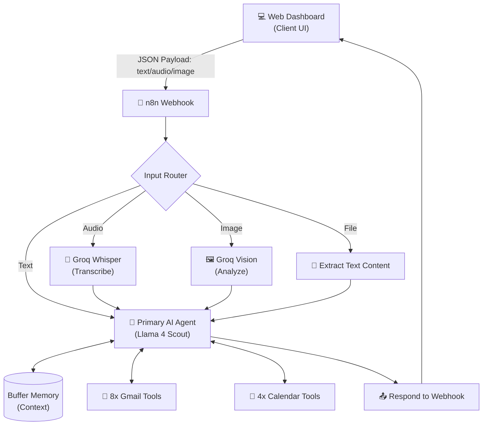
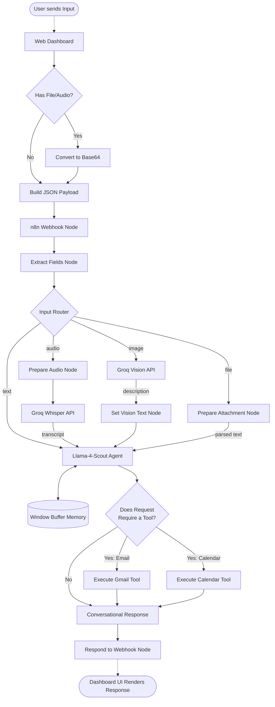

# Unified Multimodal Google Agent

A powerful, AI-driven automation system built with n8n and a custom web dashboard. This agent uses Groq's high-speed inference models (Llama 4 Scout and Whisper) to act as your personal Google Workspace assistant, capable of understanding text, voice, images, and files to manage your Gmail and Google Calendar seamlessly.

---

## 🎯 Use Case Diagram

The following diagram illustrates the primary actors and use cases this system supports:

```mermaid
usecaseDiagram
    actor User as "👤 User"
    
    package "Input Methods" {
        usecase UC_Text as "💬 Send Text Chat"
        usecase UC_Voice as "🎤 Record Voice Message"
        usecase UC_Image as "🖼️ Upload Image"
        usecase UC_File as "📄 Upload Document"
    }
    
    package "Google Agent (Groq AI)" {
        usecase AI_Process as "🧠 Understand Intent & Context"
    }

    package "Gmail Capabilities" {
        usecase G_Read as "📥 Read Recent Emails"
        usecase G_Send as "✉️ Send/Draft Emails"
        usecase G_Reply as "↩️ Reply to Emails"
        usecase G_Delete as "🗑️ Delete Emails"
        usecase G_Label as "🏷️ Manage Labels"
    }

    package "Calendar Capabilities" {
        usecase C_Read as "📅 Check Schedule"
        usecase C_Create as "➕ Schedule Meetings"
        usecase C_Update as "📝 Update Events"
        usecase C_Delete as "❌ Cancel Events"
    }

    User --> UC_Text
    User --> UC_Voice
    User --> UC_Image
    User --> UC_File

    UC_Text --> AI_Process
    UC_Voice --> AI_Process
    UC_Image --> AI_Process
    UC_File --> AI_Process

    AI_Process --> G_Read
    AI_Process --> G_Send
    AI_Process --> G_Reply
    AI_Process --> G_Delete
    AI_Process --> G_Label
    
    AI_Process --> C_Read
    AI_Process --> C_Create
    AI_Process --> C_Update
    AI_Process --> C_Delete
```

---

## 🚀 What can you do with this Agent?

This unified agent bridges the gap between human communication and rigid software APIs. Instead of clicking through menus or dealing with clunky interfaces, you can simply **tell your agent what to do**.

### 1. Multimodal Superpowers
Because the workflow includes an Input Router connected to Groq's specialized models, you aren't limited to typing:
* **Voice Commands:** Click the 🎤 microphone button on the dashboard, speak your request (e.g., *"Read my last 3 emails and draft a reply to John saying I'll be late"*). Groq Whisper will transcribe it with near-zero latency.
* **Image Analysis:** Upload a screenshot of an invitation, a flyer, or a white-boarded schedule. The Groq Vision model (Llama-4-Scout) will analyze the text/context and can automatically add the event to your calendar.
* **Document Parsing:** Upload `.txt`, `.json`, `.csv`, etc. You can say, *"Draft an email to the team summarizing this attached file."*

### 2. Gmail Management
The AI has 8 distinct Gmail tools at its disposal:
* **Email Triage:** *"Show me emails from my boss today."*
* **Drafting & Sending:** *"Send a professional email to marketing@example.com asking for the Q3 report."* (The AI formats all emails in perfect HTML).
* **Replying:** *"Reply to the latest email from Sarah and tell her the project is approved."*
* **Organization:** *"Create a new label called 'Urgent Invoices' and apply it to my last 5 emails."*
* **Cleanup:** *"Delete all promotional emails received this week."*

### 3. Google Calendar Management
The AI has 4 distinct Calendar tools:
* **Schedule Checking:** *"What does my week look like?"* or *"Do I have any conflicts tomorrow afternoon?"*
* **Event Creation:** *"Schedule a 30-minute sync with the dev team tomorrow at 2 PM."*
* **Modifications:** *"Push my 2 PM meeting to 3:30 PM."*
* **Cancellations:** *"Cancel my lunch meeting for today."*

---

## ⚙️ System Architecture

How the magic happens under the hood:



## 🔄 Detailed Execution Flowchart

Below is the step-by-step logic detailing exactly what happens from the moment you send a message:



## Setup Summary
1. **Frontend:** The dashboard (`index.html`, `app.js`, `style.css`) is a robust static site. Webhook URL is securely hardcoded in `app.js`.
2. **Backend:** The `Unified_Google_Agent.json` handles all integrations natively in n8n.
3. **AI:** Powered entirely by the `Groq` API for high-speed, cost-effective multimodal LLM execution.
